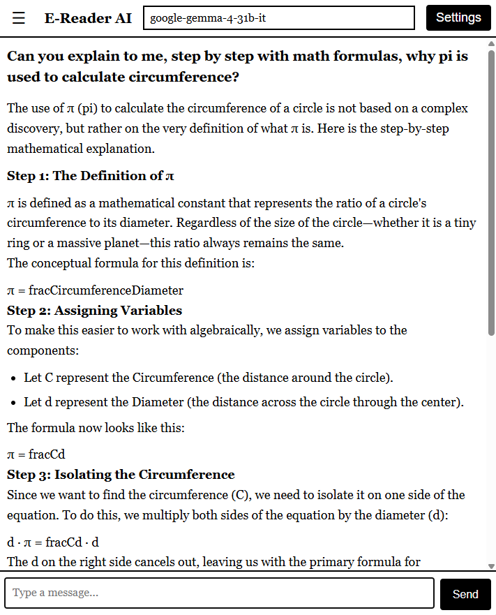

> **⚠️ AI-Generated Code Disclaimer**
> This project was written entirely by AI. It has not undergone formal code review, security auditing, or rigorous testing. Use at your own risk.

> **🧪 Proof of Concept**
> This is an experimental proof of concept exploring how to make AI chat accessible through e-reader browsers. It is **not** intended for production use.

> **🔒 Local / LAN Use Only**
> This project is designed for local and LAN use only. If you deploy this on a publicly accessible server, **you assume full responsibility** for any consequences, including but not limited to security breaches, data leaks, or unauthorized access. The authors accept no liability for misuse.

# E-Reader LLM

A lightweight gateway that lets an e-reader's built-in browser chat with any OpenAI-compatible LLM endpoint — no app installs, no sideloading, just a web page.

The e-reader browser only talks to the gateway (same-origin, plain HTTP on LAN), and the gateway proxies requests to the configured LLM endpoint.

## How It Works

```
E-Reader Browser ──HTTP──▸ Gateway (FastAPI) ──HTTP──▸ OpenAI-compatible endpoint
                              │
                              ├─ Serves static/ (index.html, app.js)
                              ├─ /api/session/config  — per-session base_url, model, api_key
                              ├─ /api/session/models   — proxy: GET {base_url}/models
                              └─ /api/chat             — proxy: POST {base_url}/chat/completions
```

## Features

- **E-reader optimized UI** — Black-on-white, large touch targets, Georgia serif font, no frameworks
- **Markdown rendering** — Bold, italic, headings, lists, code blocks, blockquotes, links, horizontal rules
- **LaTeX math support** — Inline ($...$) and display ($$...$$) math rendered as styled HTML (no MathJax/KaTeX dependency)
- **Model selection dropdown** — Fetches available models from your LLM endpoint with search/filter
- **Session-based configuration** — Base URL, model, and API key stored server-side per session (cookie `sid`)
- **Optional session persistence** — Save session config to `sessions.json` so it survives restarts
- **No build step** — Plain Python + vanilla JS, compatible with older browser engines

## Quick Start

### Prerequisites

- Python 3.10+
- An OpenAI-compatible LLM endpoint (e.g., [LM Studio](https://lmstudio.ai/), [Ollama](https://ollama.com/), [text-generation-webui](https://github.com/oobabooga/text-generation-webui), or any cloud API like [Venice.ai](https://venice.ai/))

### Install & Run

```bash
# Clone the repository
git clone https://github.com/MathiasXII/kindle-llm.git
cd kindle-llm

# Install dependencies
pip install -r requirements.txt

# Start the server (default: port 8000, host 0.0.0.0)
python -m uvicorn server:app --host 0.0.0.0 --port 8000
```

Or use the included startup script:

**PowerShell (Windows):**
```powershell
.\start.ps1                    # default: port 8000
.\start.ps1 -Port 9000         # custom port
```

**Linux:**
```bash
./start.sh                     # default: port 8000
./start.sh --port 9000        # custom port
```

**macOS:**
```bash
./start.command                # default: port 8000
./start.command --port 9000   # custom port
```

### Configure

1. Open `http://<your-pc-ip>:8000` on your e-reader or any browser on the same network
2. The settings panel opens automatically if no base URL is configured
3. Enter your LLM endpoint's base URL (e.g., `http://192.168.1.17:1234/v1` or `https://api.venice.ai/api/v1`)
4. Optionally enter an API key
5. Select a model from the dropdown
6. Start chatting

## Configuration

### Environment Variables

| Variable | Default | Description |
|---|---|---|
| `PERSIST_SESSIONS` | `0` | Set to `1` to save session config to `sessions.json` across restarts |

Copy `.env.example` to `.env` and customize:

```bash
cp .env.example .env
```

### Session Persistence

By default, sessions are in-memory and lost on restart. Enable persistence:

```bash
# In .env
PERSIST_SESSIONS=1
```

This saves `base_url`, `model`, and `api_key` to `sessions.json`. The file is written atomically to prevent corruption.

## Architecture

- **`server.py`** — Single-file FastAPI backend. Session state is in-memory (dict keyed by cookie `sid`). All LLM traffic is proxied server-side so the e-reader never hits CORS or mixed-content issues.
- **`static/index.html`** — E-reader-friendly chat UI. No frameworks. Minimal CSS optimized for e-ink displays.
- **`static/app.js`** — Plain ES5-ish JS. No build step. Uses `fetch()` for same-origin API calls. Sends full chat history on each request. Includes a custom Markdown-to-HTML renderer with LaTeX math support.

## Limitations

- **Non-streaming** — Both the gateway and frontend use `stream: false`. The entire response is returned at once.
- **No localStorage** — Session config lives server-side in cookies. The frontend does not use localStorage or sessionStorage.
- **In-memory sessions by default** — Session state is lost on server restart unless `PERSIST_SESSIONS=1` is set.

## Browser Compatibility

Designed for e-readers with older Chromium engines. Avoids:
- CSS `gap` on flex containers (use `margin` instead)
- CSS features requiring Chrome 84+
- JavaScript frameworks or modern ES modules

## License

This project is licensed under the [MIT License](LICENSE).

---

*This project was coded entirely with AI assistance and has not undergone a formal security audit.*
